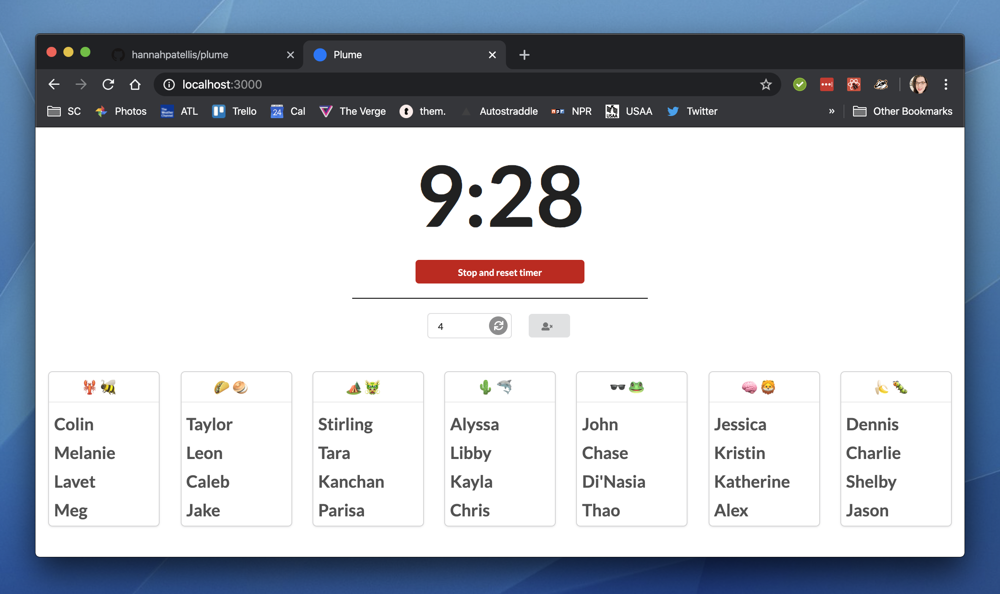

# Plume

A random group generator and countdown timer

## Intro

Plume can be used in classrooms to quickly sort students into groups of a specified size. It also includes a countdown timer that allows input in minutes and allows you to exclude absent students from group generation.

It is responsive in design so that it can fit in a small portion of the screen while something like a slideshow is also being displayed.

Plume is a React application and uses [Semantic UI](https://react.semantic-ui.com/) as the CSS framework.

## How to use

Enter the number of students you want per group into the input field and click the circular gray button. It will generate groups with that number of students. If there are leftover students, it will add them to other groups.

For example, if you have a class of 29 and you want groups of 2, you'll have one group of 3 and not one group of 1.

To change the timer, click the time and it will turn into an input field. Enter the number of minutes from which you want to count down and click the green "Start timer" button.

Once the timer has started you can click the red "Stop and reset timer" button to stop the countdown and reset back to the last input.

If a student is absent, select the rectangular gray button next to the group size input field. A modal will pop up with a list of every student. Uncheck absent students and select the green "Save" button. Now when you generate groups, that student will not be included. When you refresh the page, all students will be remarked as present. _(Feature added Dec 21)_

## How to run

To run locally, clone the repo and run `yarn install` to install the needed libraries.

Then run `yarn start` to start the React development server.

## How to setup

For use in your own class you will need to edit [/src/students.json](/src/students.json) to include an array of your students. You also need to have group names for at least half the number of total students in [/src/App.js](/src/App.js).

The application is built to be deployed to GitHub Pages. Make a new repo and copy the application files into the new repo. Change the value of the `"homepage"` property in [/package.json](/package.json) to include your username and the name of your repo. (Don't forget the `/` at the end or static assets may not load.) Then run `yarn deploy` which will run the React build script then the gh-pages deploy script. 

The gh-pages deploy script will add, commit, and push the built version of the application to a gh-pages branch in the repo and enable GitHub Pages. It will not push anything to master.

## The `archive` folder

There is an `/archive` folder which includes a previous (and non-working) version of the app that used [React95](https://github.com/arturbien/React95) as the CSS framework. At one point, this version also tried to employ the Trilogy Bootcamp Spot API.

### Enjoy! 👩🏻‍🏫

---

### Take a look at some of my other classroom apps!

[VideoRepo](https://github.com/hannahpatellis/videorepo) and [VideoRepo Uploader](https://github.com/hannahpatellis/videorepo_uploader): A MERN stack web app for storing and (minimally) organizing class lecture videos; and an Electron app for quickly adding new lectures to the database.

[HoDO Dashboard](https://github.com/hannahpatellis/hodo_dashboard) and [HoDO Desktop](https://github.com/hannahpatellis/hodo_desktop): A MERN stack web app for keeping track of and administering house points, challenges, and guidelines for the Houses of Design Olympics game for UX/UI bootcamps; and an Electron app for quickly adding new points.

[House Points Dashboard for Coding Bootcamps](https://github.com/hannahpatellis/gthousedash): The original incarnation of the Houses of Design Olympics, made for Full-Stack Flex bootcamps. *(No longer in use.)*

---

Developed by Alexandria 'Hannah' Isadora Patellis in 2019

[hannahap.com](https://hannahap.com)